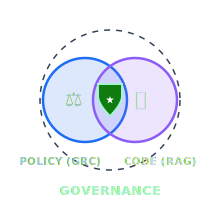
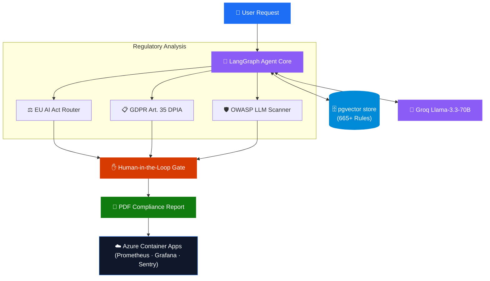

<div align="center">

<!-- Wavy Header Banner -->


<!-- Typing SVG -->
[](https://git.io/typing-svg)

<!-- Navigation Bar -->
<p align="center">
  <!-- <a href="https://farhanshahriyar.vercel.app/"></a>
  &nbsp;&nbsp; -->
  <a href="https://www.linkedin.com/in/farhanshahriyar"></a>
  &nbsp;&nbsp;
  <a href="mailto:shahriyarfarhan3101@gmail.com"></a>
  &nbsp;&nbsp;
  <a href="https://github.com/Shahriyar31"></a>
</p>

<!-- Live Indicators -->
<p align="center">
  
  &nbsp;&nbsp;
  
  &nbsp;&nbsp;
  
</p>

</div>

---

<div align="center">
  
</div>

<p align="center">
  
</p>

<table border="0" cellpadding="0" cellspacing="0">
<tr>
<td width="65%" valign="top">
<h3>🛡️ Bridging Policy & Production Code</h3>
<p>I operate where regulatory requirements and hands-on system architecture converge. While policy analysts write compliance papers and engineers code black boxes, I write <b>Compliance-as-Code</b>—translating the <b>EU AI Act, GDPR, and NIST AI RMF</b> into automated CI/CD security gates and audited RAG safeguards.</p>
<p>Currently Working Student at <b>Nordex Group</b> and researching security threats within the Model Context Protocol (MCP) at <b>TU Hamburg</b>.</p>
<p><b>Core Objective:</b> Guaranteeing that enterprise agentic systems remain secure, deterministic, and fully compliant under global legal frameworks.</p>
</td>
<td width="35%" align="center" valign="middle">

</td>
</tr>
</table>

<details open>
  <summary>🎓 <b>Affiliations & Focus Areas</b></summary>
  <br>
  
  <p align="center">
    
    
    <!--  -->
  </p>
  
  *   **Academic Base:** Hamburg University of Technology (TU Hamburg) — MSc Data Science. High-dimensional data analytics, OT security, and AI system modeling.
  *   **Corporate Base:** Nordex Group — Working Student.
  *   **Specializations:** GDPR Article 35 (DPIAs), EU AI Act Annex III classifications, OWASP LLM Top 10 auditing, and Model Context Protocol (MCP) threat modeling.
</details>
<p align="center">
  
</p>

<!--
## 🔬 Research Spotlight

<table width="100%" border="0" cellpadding="10" cellspacing="0">
<tr>
<td style="border-left: 5px solid #8b5cf6; background-color: #0d1117; padding: 15px; border-radius: 4px;">
<b>📄 RESEARCH PREPRINT (TU HAMBURG)</b><br/>
<h4 style="margin: 5px 0; color: #1d6ef5;">Mapping OWASP LLM Top 10 to EU AI Act Requirements: A Security Governance Framework for Enterprise RAG Systems</h4>
<i>Published April 2026 · Otology &amp; AI Security Lab</i>
</td>
</tr>
</table>

| Findings & Contribution | Description |
| :--- | :--- |
| **🔗 Legal Friction** | Examined how EU AI Act Article 14 (Human Oversight) collides with GDPR Article 22 (Automated individual decision-making) when RAG tools support enterprise decisions. |
| **🔐 MCP Vulnerability** | Documented how the *confused deputy problem* in Model Context Protocol (MCP) tool bindings triggers data privacy breaches under GDPR Article 4(12). |
| **📋 Governance Matrix** | Designed a direct regulatory mapping translating every OWASP LLM risk into specific EU AI Act compliance controls. |

<p align="center">
  
</p>
-->

## 🛡️ Featured Platform: Argus AI
### *The Automated EU AI Act & GDPR Auditing System*

<div align="center">
  <a href="https://eu-ai-act-governance-platform.vercel.app"></a>
  &nbsp;&nbsp;
  <a href="https://eu-ai-governance.salmonocean-15ddaf55.germanywestcentral.azurecontainerapps.io"></a>
  &nbsp;&nbsp;
  <a href="https://github.com/Shahriyar31/eu-ai-act-governance-platform"></a>
</div>



#### 🛠️ Deep Tech Architecture
* **Intelligent LangGraph Router:** Automates risk classification under the EU AI Act (High, Limited, Minimal) and dynamically routes workflows.
* **Compliance Automation:** Autogenerates GDPR Article 35 Data Protection Impact Assessments (DPIAs) and runs OWASP LLM Top 10 vulnerability checks.
* **Regulatory Knowledge Base:** Standardized hybrid vector search on a `pgvector` store indexing **665+ regulatory database chunks**, querying Groq Llama-3.3-70b.
* **DevSecOps Gateways:** Integrates SCA, SAST, and Trivy scans inside the CI/CD pipeline, blocking builds on critical findings (**114+ successful builds**).

<p align="center">
  
</p>

## 🏭 Professional Experience
* **Working Student** — Nordex Group *(Aug 2025 – Present | Hamburg, Germany)*
<p align="center">
  
</p>

## 🔬 Engineering Portfolio

| Status | Project Name | One-Line Narrative | Technology Stack | Action |
| :---: | :--- | :--- | :--- | :---: |
| ⚡ | **Digital Twin Dashboard** | Real-time industrial telemetry. Shrank container image size from 900MB to 150MB. | `Kafka` `Flink` `InfluxDB` `Dash` | [View Code 🔗](https://github.com/rkraeuter/DigitalTwinGF3) |
| 📊 | **StockFlow** | End-to-end real-time financial stream ingestion pipeline. | `Kafka` `AWS (S3, Glue, Athena)` `Python` | [View Code 🔗](https://github.com/Shahriyar31/StockFlow-Real-Time-Stock-Market-Data-Engineering-with-Kafka) |
| 🐔 | **Poultry Shield** | VGG16 classifier with 97.51% accuracy and versioned DVC data pipeline. | `TensorFlow` `Flask` `DVC` `EC2` | [View Code 🔗](https://github.com/Shahriyar31/Poultry_Shield-Deep-Learning-for-Poultry-Coccidiosis-Diagnosis) |
| ☢️ | **Radiation Tracker** | Containerized real-time environmental radiation sensor stream processing. | `Kafka` `Flink` `GCP` `Docker` | [View Code 🔗](https://github.com/Shahriyar31/Radiaton_Tracking) |
<p align="center">
  
</p>

## 🛠️ Technical Arsenal

### ⚖️ AI Governance & Compliance
<p align="left">
  
  
  
  
  
  
  
</p>

### 🤖 AI, LLM & Agentic Systems
<p align="left">
  
  
  
  
  
  
  
  
  
  
  
</p>

### ⚙️ DevSecOps, Cloud & Infrastructure
<p align="left">
  
  
  
  
  
  
</p>

### 🔍 Security Scanning & SCA
<p align="left">
  
  
  
  
  
  
  
</p>

### 📊 Data pipelines & Monitoring
<p align="left">
  
  
  
  
  
  
</p>
<p align="center">
  
</p>

## 📈 GitHub Analytics

<div align="center">
  <h3>📊 GitHub Infographics</h3>
  
  <table border="0">
    <tr>
      <td align="center" valign="top">
        
      </td>
      <td align="center" valign="top">
        
      </td>
    <tr>
      <td align="center" valign="top" colspan="2">
        
      </td>
    </tr>
  </table>
  
  <br/>
  
  
</div>

<div align="center">
  <picture>
    <source media="(prefers-color-scheme: dark)" srcset="https://raw.githubusercontent.com/Shahriyar31/Shahriyar31/output/github-contribution-grid-snake-dark.svg" />
    <source media="(prefers-color-scheme: light)" srcset="https://raw.githubusercontent.com/Shahriyar31/Shahriyar31/output/github-contribution-grid-snake.svg" />
    
  </picture>
</div>

<p align="center">
  
</p>

## ♟️ Community Chess Tournament

Welcome to my online open chess tournament! Anyone visiting my profile can play. Click any legal move link below to automatically submit a turn via a GitHub Issue!

<div align="center">

<h3>It is <!-- BEGIN TURN -->black<!-- END TURN -->'s turn to play!</h3>

<!-- BEGIN CHESS BOARD -->
|   | H | G | F | E | D | C | B | A |   |
|---|:-:|:-:|:-:|:-:|:-:|:-:|:-:|:-:|:-:|
| **1** |  |  |  |  |  |  |  |  | **1** |
| **2** |  |  |  |  |  |  |  |  | **2** |
| **3** |  |  |  |  |  |  |  |  | **3** |
| **4** |  |  |  |  |  |  |  |  | **4** |
| **5** |  |  |  |  |  |  |  |  | **5** |
| **6** |  |  |  |  |  |  |  |  | **6** |
| **7** |  |  |  |  |  |  |  |  | **7** |
| **8** |  |  |  |  |  |  |  |  | **8** |
|   | **H** | **G** | **F** | **E** | **D** | **C** | **B** | **A** |   |
<!-- END CHESS BOARD -->

<br/>

<h4>Move History &amp; Contributors</h4>

<table border="0">
<tr>
<td width="50%" valign="top">

**Latest Moves**
<!-- BEGIN LAST MOVES -->

| Move | Author |
| :--: | :----- |
| `A2` to `A3` | [ @Shahriyar31](https://github.com/Shahriyar31) |
| `Start game` | [ @System](https://github.com/System) |

<!-- END LAST MOVES -->

</td>
<td width="50%" valign="top">

**Top Contributors**
<!-- BEGIN TOP MOVES -->

| Total moves |  User  |
| :---------: | :----- |
| 1 | [@Shahriyar31](https://github.com/Shahriyar31) |

<!-- END TOP MOVES -->

</td>
</tr>
</table>

<br/>

<h4>Select a Move</h4>

<!-- BEGIN MOVES LIST -->
|  FROM  | TO (Just click a link!) |
| :----: | :---------------------- |
| **A7** | [A5](https://github.com/Shahriyar31/Shahriyar31/issues/new?body=Please+do+not+change+the+title.+Just+click+%22Submit+new+issue%22.+You+don%27t+need+to+do+anything+else+%3AD&title=Chess%3A+Move+A7+to+A5), [A6](https://github.com/Shahriyar31/Shahriyar31/issues/new?body=Please+do+not+change+the+title.+Just+click+%22Submit+new+issue%22.+You+don%27t+need+to+do+anything+else+%3AD&title=Chess%3A+Move+A7+to+A6) |
| **B7** | [B5](https://github.com/Shahriyar31/Shahriyar31/issues/new?body=Please+do+not+change+the+title.+Just+click+%22Submit+new+issue%22.+You+don%27t+need+to+do+anything+else+%3AD&title=Chess%3A+Move+B7+to+B5), [B6](https://github.com/Shahriyar31/Shahriyar31/issues/new?body=Please+do+not+change+the+title.+Just+click+%22Submit+new+issue%22.+You+don%27t+need+to+do+anything+else+%3AD&title=Chess%3A+Move+B7+to+B6) |
| **B8** | [A6](https://github.com/Shahriyar31/Shahriyar31/issues/new?body=Please+do+not+change+the+title.+Just+click+%22Submit+new+issue%22.+You+don%27t+need+to+do+anything+else+%3AD&title=Chess%3A+Move+B8+to+A6), [C6](https://github.com/Shahriyar31/Shahriyar31/issues/new?body=Please+do+not+change+the+title.+Just+click+%22Submit+new+issue%22.+You+don%27t+need+to+do+anything+else+%3AD&title=Chess%3A+Move+B8+to+C6) |
| **C7** | [C5](https://github.com/Shahriyar31/Shahriyar31/issues/new?body=Please+do+not+change+the+title.+Just+click+%22Submit+new+issue%22.+You+don%27t+need+to+do+anything+else+%3AD&title=Chess%3A+Move+C7+to+C5), [C6](https://github.com/Shahriyar31/Shahriyar31/issues/new?body=Please+do+not+change+the+title.+Just+click+%22Submit+new+issue%22.+You+don%27t+need+to+do+anything+else+%3AD&title=Chess%3A+Move+C7+to+C6) |
| **D7** | [D5](https://github.com/Shahriyar31/Shahriyar31/issues/new?body=Please+do+not+change+the+title.+Just+click+%22Submit+new+issue%22.+You+don%27t+need+to+do+anything+else+%3AD&title=Chess%3A+Move+D7+to+D5), [D6](https://github.com/Shahriyar31/Shahriyar31/issues/new?body=Please+do+not+change+the+title.+Just+click+%22Submit+new+issue%22.+You+don%27t+need+to+do+anything+else+%3AD&title=Chess%3A+Move+D7+to+D6) |
| **E7** | [E5](https://github.com/Shahriyar31/Shahriyar31/issues/new?body=Please+do+not+change+the+title.+Just+click+%22Submit+new+issue%22.+You+don%27t+need+to+do+anything+else+%3AD&title=Chess%3A+Move+E7+to+E5), [E6](https://github.com/Shahriyar31/Shahriyar31/issues/new?body=Please+do+not+change+the+title.+Just+click+%22Submit+new+issue%22.+You+don%27t+need+to+do+anything+else+%3AD&title=Chess%3A+Move+E7+to+E6) |
| **F7** | [F5](https://github.com/Shahriyar31/Shahriyar31/issues/new?body=Please+do+not+change+the+title.+Just+click+%22Submit+new+issue%22.+You+don%27t+need+to+do+anything+else+%3AD&title=Chess%3A+Move+F7+to+F5), [F6](https://github.com/Shahriyar31/Shahriyar31/issues/new?body=Please+do+not+change+the+title.+Just+click+%22Submit+new+issue%22.+You+don%27t+need+to+do+anything+else+%3AD&title=Chess%3A+Move+F7+to+F6) |
| **G7** | [G5](https://github.com/Shahriyar31/Shahriyar31/issues/new?body=Please+do+not+change+the+title.+Just+click+%22Submit+new+issue%22.+You+don%27t+need+to+do+anything+else+%3AD&title=Chess%3A+Move+G7+to+G5), [G6](https://github.com/Shahriyar31/Shahriyar31/issues/new?body=Please+do+not+change+the+title.+Just+click+%22Submit+new+issue%22.+You+don%27t+need+to+do+anything+else+%3AD&title=Chess%3A+Move+G7+to+G6) |
| **G8** | [F6](https://github.com/Shahriyar31/Shahriyar31/issues/new?body=Please+do+not+change+the+title.+Just+click+%22Submit+new+issue%22.+You+don%27t+need+to+do+anything+else+%3AD&title=Chess%3A+Move+G8+to+F6), [H6](https://github.com/Shahriyar31/Shahriyar31/issues/new?body=Please+do+not+change+the+title.+Just+click+%22Submit+new+issue%22.+You+don%27t+need+to+do+anything+else+%3AD&title=Chess%3A+Move+G8+to+H6) |
| **H7** | [H5](https://github.com/Shahriyar31/Shahriyar31/issues/new?body=Please+do+not+change+the+title.+Just+click+%22Submit+new+issue%22.+You+don%27t+need+to+do+anything+else+%3AD&title=Chess%3A+Move+H7+to+H5), [H6](https://github.com/Shahriyar31/Shahriyar31/issues/new?body=Please+do+not+change+the+title.+Just+click+%22Submit+new+issue%22.+You+don%27t+need+to+do+anything+else+%3AD&title=Chess%3A+Move+H7+to+H6) |
<!-- END MOVES LIST -->

</div>

<p align="center">
  
</p>

## ⚡ System Operation Logs (Recent Activity)

```bash
$ cat ~/.logs/activity.log
```

<!--START_SECTION:activity-->
1. 🛡️ Audited RAG agent MCP tool access parameters at [Shahriyar31/eu-ai-act-governance-platform](https://github.com/Shahriyar31/eu-ai-act-governance-platform)
2. 🚀 Configured Sentry telemetry tracing on Azure Container Apps
3. 📦 Updated dependencies for pip-audit check validation in CI/CD pipeline
<!--END_SECTION:activity-->

<p align="center">
  
</p>

<!-- Wavy Footer Banner -->
<div align="center">
  
  
  <sub>Hamburg, Germany · TU Hamburg MSc Data Science · Working Student @ Nordex Group</sub>
</div>
